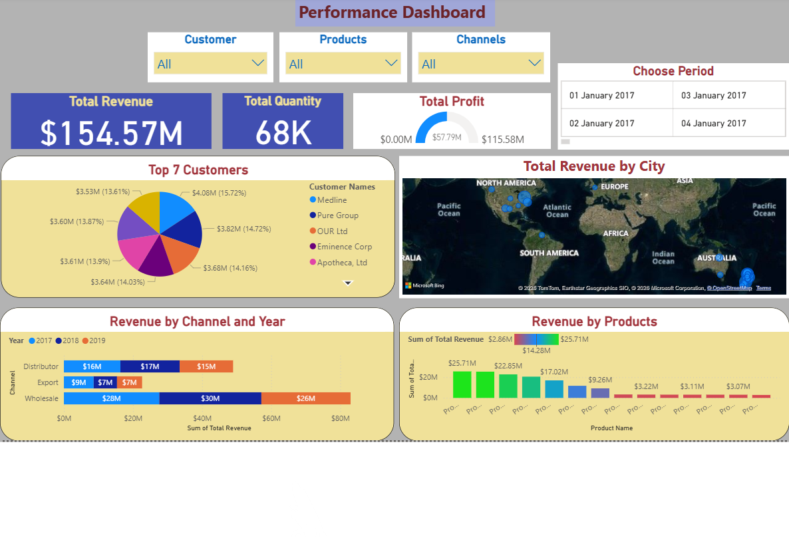

# 📊 Sales Performance Dashboard (Power BI)

## 📌 Project Overview
This project analyzes company sales performance to help management monitor revenue trends, product performance, and regional distribution. The dashboard provides actionable insights into customer behavior and delivery efficiency.

## 📸 Dashboard Preview

## 🛠️ Data Process
**1. Data Gathering:**
* Imported 4 datasets: `Sales Orders`, `Customers`, `Regions`, and `Products`.
* Performed data cleaning (removed nulls, fixed data types) using Power Query.

**2. Data Modeling:**
* Established a **Star Schema** to link transaction data with dimension tables.
* Created relationships:
    * `Sales Orders` ↔ `Customers` (via Customer Index)
    * `Sales Orders` ↔ `Regions` (via Region Index)
    * `Sales Orders` ↔ `Products` (via Product Description Index)

**3. DAX Calculations:**
Key metrics were created using DAX to drive the visuals:
* **Cost** = `[Total Unit Cost] * [Order Quantity]`
* **Total Revenue** = `SUM(Order Quantity) * SUM(Unit Price)`
* **Total Profit** = `[Total Revenue] - [Cost]`
* **Delivery Time** = `DATEDIFF(Order Date, Ship Date, DAY)`

## 🔍 Key Insights & Findings
This dashboard helps the Sales & Marketing team by highlighting:

* **🏆 Top Customers:** Identified high-value clients generating the most revenue, enabling targeted loyalty programs.
* **📦 Best-Selling Products:** Highlighted products with the highest sales volume to optimize stock levels.
* **📉 Profit Analysis:** Calculated profit margins per order to identify low-margin products that need pricing adjustments.
* **🌍 Regional Performance:** Mapped sales distribution to identify underperforming regions for marketing focus.
* **🚚 Operational Efficiency:** Analyzed delivery times to spot delays in specific regions or product lines.

## 💻 Technical Stack
* **Tool:** Microsoft Power BI Desktop
* **Transformation:** Power Query Editor
* **Language:** DAX (Data Analysis Expressions)

---
*This project demonstrates proficiency in data modeling, ETL processes, and business intelligence reporting.*
